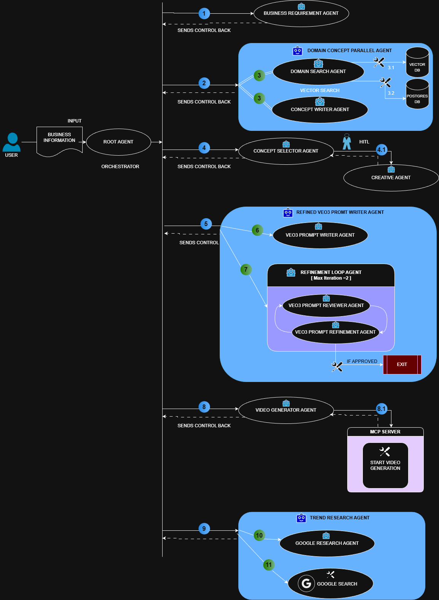
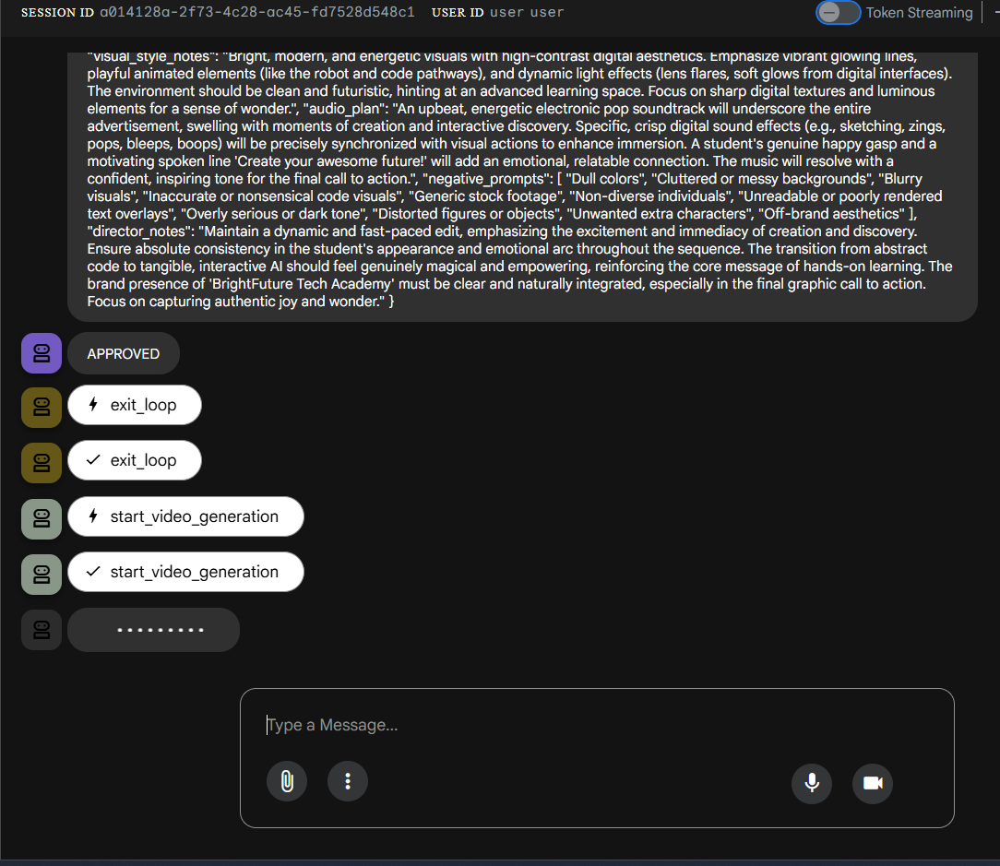
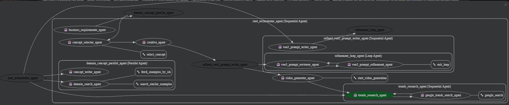

# Table of Contents

1. [Problem Statement](#1-problem-statement)
2. [Our Solution](#2-our-solution)
3. [System Architecture](#3-system-architecture)
4. [Setup](#4-setup)
   - [Prerequisites](#prerequisites)
   - [Code Setup](#code-setup)
   - [Setup of MCP Server](#setup-of-mcp-server)
5. [Output Visuals](#5-output-visuals)
6. [Documentation: Observability](#6-documentation-observability)

# 1. Problem Statement

Small businesses often lack the creative skills, tools, and resources needed to produce digital video ads, making it difficult to compete in a world dominated by short-form content on Instagram, YouTube, Facebook, and WhatsApp.
Our AI Video Ad Generator solves this by using a fully automated multi-agent system that transforms simple business details into professional, social-media-ready video ads.


# 2. Our Solution

Our solution is a fully automated, cost-effective multi-agent video ad generator that converts simple business details into a polished, social-media-ready advertisement. Specialized agents handle research, scriptwriting, image generation, and video creation in a seamless pipeline. This makes high-quality advertising accessible and affordable for small businesses without any design, editing, or technical skills.


# 3.  System Architecture

<p align="center">
  
</p>


# 4. Setup

## Prerequisites

Before setup, ensure the following are installed on your system:

* **Python 3.12**
* **UV** (Python package manager)
* **Git**
* **PostgreSQL**
* A **Pinecone** account → [https://www.pinecone.io/](https://www.pinecone.io/)
* **Google API Key** (for `gemini-2.5-flash` and video generation using `veo-3.1-fast-generate-preview`)

### Notes on Pinecone & API Keys

* Pinecone is used to store "production-ready inspiring examples."
* For now, only index creation is required; the project will run even without stored examples.
* If you plan to store examples, you will need an **OpenAI API Key** for generating embeddings.
* You may leave the OpenAI key as an empty string `""` — the program handles this gracefully without breaking.

---

## Code Setup

### Step 1: Clone the Repository

Open **Command Prompt** and navigate to any folder:

```
C:\Users\...\> 
```

Run:

```bash
git clone https://github.com/jatindera/agentic-ai-video-ad-generator.git
```

This creates a folder:

```
agentic-ai-video-ad-generator
```

Open this folder in **VSCode**.

---

### Step 2: Setup `.env` File

Inside the **backend** folder:

1. Create a new file:

   ```
   backend/.env
   ```
2. Open `backend/.env.example`
3. Copy all contents → paste into the new `.env`
4. Add required keys (Pinecone key, Google key, DB details, etc.)

Restart your VSCode terminal after creating `.env`.

---

### Step 3: Install Dependencies

From the project root:

```
C:\Users\...\agentic-ai-video-ad-generator>
```

Run:

```bash
uv sync
```

Then activate the environment:

```bash
.venv/Scripts/activate.ps1
```

Navigate to the backend:

```bash
cd backend
```

---

### Step 4: Fix Python Interpreter Warnings

If VSCode shows warnings:

1. Press **Ctrl + Shift + P** → **Command Palette**
2. Search: **Python: Select Interpreter**
3. Select:

```
.\.venv\Scripts\python.exe
```

---

### Step 5: Setup Pinecone

Run:

```bash
uv run .\pinecone_setup.py
```

(OR)

```bash
python .\pinecone_setup.py
```

---

### Step 6: Disable Video Generation (Before MCP Setup)

Open:

```
backend/app/video_pipeline_app/root_agent/agent.py
```

Around line **34**, comment these three lines:

```python
# video_generator_agent,
# trends_research_agent,
# a2a_portfolio_agent
```

This is required because MCP server is not set up yet.

---

### Step 7: Start the Main Project

Make sure you are inside:

```
backend/
```

Run:

```bash
uvicorn app.main:app --reload --port 8000
```

Open browser:

```
http://localhost:8000/
```

The **ADK Web Interface** will open.

---

### Step 8: Test the Pipeline

Enter:

```
1. Business Name: BrightFuture Tech Academy
2. What do you do? We teach Python and AI to kids, school students, and freshers.
3. Target Audience: Kids (10–17), beginners, parents looking for coding classes.
4. Problem You Solve: Students do not get practical coding experience.
5. What makes you unique? Hands-on projects, fun learning, job-ready skills.
6. Tone of Your Brand: Friendly, youthful, motivating.
7. Goal of Advertisement: Increase awareness and new enrollments.
```

Your pipeline should run successfully at this stage.

---

## Setup of MCP Server

### Step 1: Clone Only the MCP Branch

Open a **new Command Prompt** in a different folder, e.g.:

```
C:\xyz>
```

Run:

```bash
git clone --single-branch --branch mcp https://github.com/jatindera/agentic-ai-video-ad-generator.git
```

Rename the new folder `agentic-ai-video-ad-generator` to:

```
mcp
```

Open this folder in **VSCode**.

---

### Step 2: Setup `.env` for MCP

Create a `.env` in the root of the MCP project:

```
GOOGLE_API_KEY=xxxx
```

The key must support:

```
veo-3.1-fast-generate-preview
```

(A paid Google Cloud key was used during development.)

---

### Step 3: Install MCP Dependencies

Run:

```bash
uv sync
```

Activate:

```bash
.venv/Scripts/activate.ps1
```

Start MCP server:

```bash
uv run .\main.py --reload
```

You should now see the **FastMCP server running**.

---

### Step 4: Re-enable Video Generation in Main Project

Go back to:

```
backend\app\video_pipeline_app\root_agent\agent.py
```

Uncomment:

```python
video_generator_agent,
trends_research_agent,
```

Leave **a2a_portfolio_agent** commented.

Restart the main backend.

Re-run the pipeline — your video will now be generated using the MCP server.

# 5. Output Visuals
## Working Pipeline
<p align="center">
  
</p>

## Workflow
<p align="center">
  
</p>


# 6. Documentation: Observability

A full observability implementation is included under:

```
backend/app/observability
```

This includes:

* Logging
* Tracing
* Metrics
* ADK Observability Plugin
* Callbacks & instrumentation

Refer to the documentation inside the folder for detailed usage.

---
